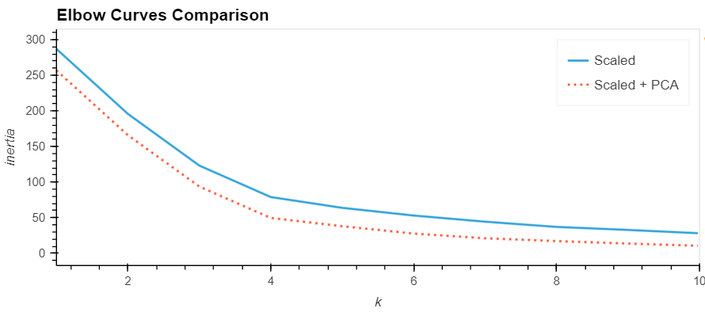
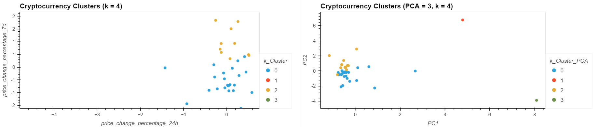

# Module 19 Report: CryptoClustering
Used basic code syntax from 19 modules.

## Overview
In this analysis, we used what we've learned with Python and unsupervised machine learning to predict if cryptocurrencies would be affected by 24H or 7D changes in prices. We explore the affects of changing features we work with to see which methods are "better" and if there is in fact a difference in results.

### Find the Best Value for k Using the PCA Data & Cluster Cryptocurrencies with K-means Using the PCA Data
* The best value for k=4 when using the PCA data, which is the same best k-value found when using the original data.

### Visualize and Compare the Results
  * After visually analyzing the cluster analysis results, what is the impact of using fewer features to cluster the data using K-Means?
  * Using 3 features instead of 7 features did not make an impact on the elbow curve. As seen in the side-by-side comparisons of the elbow curves (scaled vs scaled + PCA), the results are the same. After applying PCA to the data and reducing to 3 features, 89.5% of the variance in the data is explained by these three features, and the predictions matched those of the clusters obtained from the prior method with 7 features.
